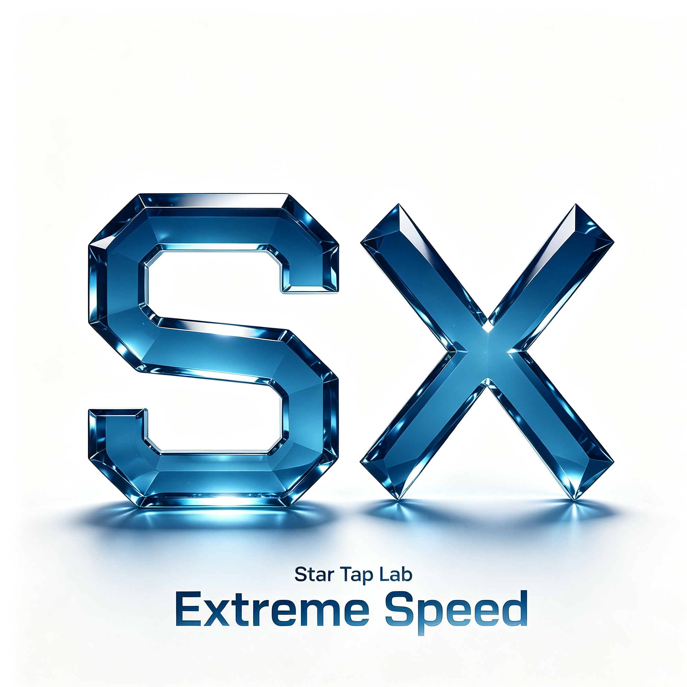

<p align="center">
  
</p>

<h1 align="center">STS-X</h1>
<p align="center">
  <strong>下一代 AI 代码搜索引擎</strong><br>
  AST感知切块 · BM25极速全文搜索 · MCP原生协议 · 17MB零依赖
</p>

<p align="center">
  <a href="https://github.com/cscb603/sts-x/releases">
    
  </a>
  
  
  <a href="https://github.com/cscb603/sts-x/blob/main/LICENSE">
    
  </a>
</p>

<p align="center">
  
  
  
</p>

<p align="center">
  <a href="#快速开始">快速开始</a> ·
  <a href="#ai-原生设计">AI原生设计</a> ·
  <a href="#mcp-服务">MCP服务</a> ·
  <a href="#用例">用例</a> ·
  <a href="#技术规格">技术规格</a> ·
  <a href="#构建">构建</a>
</p>

---

STS-X 是一个**面向 AI Agent 的代码搜索引擎**，专为大模型时代设计。与 IDE 内置搜索或 grep/ripgrep 等传统工具不同，STS-X 从内核就围绕 AI 的使用场景构建：默认输出结构化 JSON、内置 MCP HTTP 服务供 AI Agent 调用、基于 AST 语法树切块返回完整的函数/类代码块而非零散行。

### 它解决什么问题？

| 场景 | 传统工具 | STS-X |
|------|---------|-------|
| AI Agent 搜索代码 | 返回纯文本，AI 需要自己解析 | 返回结构化 JSON，字段清晰，自带 `_ai_instructions` 使用指南 |
| 需要完整函数上下文 | grep 返回零散行，看不懂 | AST 感知切块，按函数/类/方法返回完整代码块 |
| 集成到 AI 工作流 | 需要写脚本解析输出 | 内置 MCP HTTP 服务，GET /tools 自动发现，POST /search 即用 |
| 跨平台部署 | 需要安装运行时（Python/Node） | 17MB 单二进制，零依赖，下载即用 |
| 索引管理 | 手动创建、手动更新 | 自动索引、自动缓存、文件变更自动重建 |
| Windows 中文路径 | 乱码/编码问题 | 内建 POSIX 路径归一化，原生兼容 |

---

## 快速开始

### 一分钟上手

```bash
# 1. 下载（macOS）
curl -L https://github.com/cscb603/sts-x/releases/latest/download/sts-x-aarch64-apple-darwin -o sts-x && chmod +x sts-x
sudo mv sts-x /usr/local/bin/

# 2. 进入任意项目目录，直接搜索（自动索引、无需额外步骤）
cd /your-project
sts-x search "token verification"

# 3. 搜索文件名
sts-x search "config" -f

# 4. 人类友好模式
sts-x search "token verification" -H
```

```powershell
# Windows（PowerShell）
curl -L https://github.com/cscb603/sts-x/releases/latest/download/sts-x-x86_64-pc-windows-gnu.exe -o sts-x.exe
.\sts-x.exe search "token verification"
```

### 启动 MCP 服务（AI Agent 模式）

```bash
# 启动服务，自动探测项目根
sts-x serve

# AI Agent 调用
curl -X POST http://127.0.0.1:9876/search \
  -H "Content-Type: application/json" \
  -d '{"query":"token verification","top_k":3}'
```

---

## AI 原生设计

STS-X 从架构设计之初就面向 AI，而非事后适配。

### 自说明响应

每个搜索响应自动携带 `_ai_instructions` 字段，包含完整的 STS-X 使用指南、参数说明、MCP 端点用法。**AI Agent 只需一次调用即可完全掌握 STS-X 的全部能力**，无需查阅外部文档。

```json
{
  "query": "token verification",
  "results": [
    {
      "score": 0.97,
      "path": "src/auth/jwt.rs",
      "lines": [15, 42],
      "highlight_lines": [18, 25],
      "kind": "Function",
      "name": "verify_token",
      "signature": "pub fn verify_token(token: &str, secret: &[u8]) -> Result<Claims>",
      "language": "rust",
      "code": "pub fn verify_token(token: &str, secret: &[u8]) -> Result<Claims> { ... }"
    }
  ],
  "total_hits": 5,
  "search_time_ms": 1,
  "_ai_instructions": "STS-X is an AI code search engine..."
}
```

### 智能默认值（v0.2.0）

| 参数 | 默认值 | 设计理由 |
|------|--------|---------|
| `top_k` | **3** | 返回最相关结果，AI 场景下节省大量 token |
| `context_lines` | **5** | 匹配行上下各 5 行，足够理解代码结构又不过度 |
| 输出格式 | **JSON** | AI 最擅长的结构化数据格式 |

### 代码后处理引擎

- **高亮行标注**：`highlight_lines` 字段精确标注查询词在代码块中的行号，AI 可直接定位关键代码
- **上下文控制**：通过 `--context N` 参数灵活控制返回行数，N=0 时返回完整代码块

---

## MCP 服务

STS-X 内置完整的 MCP（Model Context Protocol）HTTP 服务，专为 AI Agent 集成设计。

### 端点总览

| 方法 | 路径 | 用途 | AI Agent 使用场景 |
|------|------|------|-----------------|
| `GET` | `/` | 服务文档 + curl 示例 | AI 探索能力时获取帮助 |
| `GET` | `/health` | 健康检查 | 确认服务可用性 |
| `GET` | `/tools` | MCP 工具发现 | **自动发现搜索能力**，返回标准 MCP Tool Schema |
| `POST` | `/search` | 执行搜索 | **核心搜索接口**，支持所有搜索模式 |

### 工具发现（AI 无需预配置）

```bash
# AI Agent 自动发现 STS-X 的全部搜索能力
curl http://127.0.0.1:9876/tools
# 返回 MCP 标准格式，包含参数名、类型、描述、默认值
```

### AI Agent 调用示例

```bash
# 代码搜索（默认）
curl -X POST http://127.0.0.1:9876/search \
  -H "Content-Type: application/json" \
  -d '{"query":"error handling","top_k":3}'

# 文件名搜索
curl -X POST http://127.0.0.1:9876/search \
  -H "Content-Type: application/json" \
  -d '{"query":"config","filename":true}'

# 指定项目路径
curl -X POST http://127.0.0.1:9876/search \
  -H "Content-Type: application/json" \
  -d '{"query":"database","path":"/path/to/project"}'
```

---

## 搜索模式

| 模式 | CLI 命令 | MCP 参数 | 搜索范围 | 输出类型 |
|------|----------|---------|---------|---------|
| **Code** | `search "query"` | `{"query":"..."}` | 代码内容 | AST 切块（函数/类） |
| **Filename** | `search "query" -f` | `{"query":"...","filename":true}` | 文件名 | 匹配的文件路径 |
| **All** | `search "query" --all` | `{"query":"...","all":true}` | 所有文件内容 | 代码 + 文本 + 配置 |

---

## 用例

### 1. AI 编程助手集成

Cursor、Windsurf、VS Code Copilot 等 AI 编程工具在执行代码搜索时，可直接调用 STS-X MCP 服务获取结构化结果，替代传统的 grep/ripgrep。

### 2. 代码库理解与迁移

```bash
# 快速理解项目中所有数据库操作
sts-x search "INSERT INTO|SELECT.*FROM"

# 定位所有错误处理逻辑
sts-x search "Error|Result<" --context 0

# 搜索某函数的完整实现
sts-x search "fn authenticate" --context 0
```

### 3. 自动化 CI/CD

```bash
# 检查是否所有 TODO/FIXME 都已处理
sts-x search "TODO|FIXME|HACK" --all -H

# 检查敏感信息是否泄露
sts-x search "password|secret_key|api_key"
```

---

## 技术规格

| 项目 | 详情 |
|------|------|
| **版本** | v0.2.0 |
| **二进制大小** | 17MB（strip 后） |
| **搜索延迟** | 0–2ms（千级文件） |
| **索引引擎** | Tantivy BM25（自定义 code 分词器） |
| **AST 解析** | tree-sitter（9 种语言） |
| **MCP 服务** | axum HTTP，RESTful 设计 |
| **外部依赖** | 零 |
| **默认输出** | JSON（AI 原生格式） |
| **支持语言** | Rust · Python · JavaScript · TypeScript · TSX · Java · C · C++ · Go |
| **响应字段** | score · path · lines · highlight_lines · kind · name · signature · language · code · _ai_instructions |
| **索引存储** | 系统缓存目录（不污染项目） |
| **可选增强** | ONNX embedding + BGE Reranker（`--features semantic`） |
| **平台** | macOS ARM64 · Windows x86_64 |
| **许可证** | MIT |

---

## 构建

```bash
# 默认构建（BM25 模式，17MB）
cargo build --release

# 语义搜索增强（ONNX embedding，约 30MB）
cargo build --release --features semantic

# macOS .app 包
bash scripts/build.sh mac

# Windows 交叉编译
bash scripts/build.sh windows
```

### 项目结构

```
sts-x/
├── src/
│   ├── main.rs            # 程序入口
│   ├── lib.rs             # 库入口
│   ├── cli/               # 命令行接口（search/serve/index/status）
│   ├── indexer/           # Tantivy 索引引擎
│   ├── search/            # 搜索管线
│   ├── chunker/           # tree-sitter AST 感知切块
│   ├── embed/             # ONNX embedding（可选特征）
│   ├── server/            # MCP HTTP 服务
│   ├── postprocess.rs     # 代码后处理（高亮行 · 上下文控制）
│   ├── cache.rs           # 跨平台缓存目录管理
│   └── types/             # 数据结构 + AI 输出格式
├── assets/                # 图标资源
├── scripts/               # 构建脚本
└── index.html             # 宣传页
```

---

## 为什么选择 STS-X？

| 对比维度 | grep/ripgrep | IDE 内置搜索 | Everything | **STS-X** |
|---------|-------------|-------------|-----------|----------|
| AI 原生输出 | ❌ 纯文本 | ❌ 纯文本 | ❌ 纯文本 | **✅ 结构化 JSON** |
| MCP 协议 | ❌ | ❌ | ❌ | **✅ 内置** |
| 工具自发现 | ❌ | ❌ | ❌ | **✅ GET /tools** |
| AST 感知切块 | ❌ 零散行 | ❌ 零散行 | ❌ | **✅ 函数/类完整块** |
| 自动索引 | ❌ | ❌ | ❌ | **✅ 系统缓存** |
| 项目根自动探测 | ❌ | ❌ | ❌ | **✅ 13种标记** |
| 跨平台 | ✅ | ❌ | ❌ Windows only | **✅ macOS + Windows** |
| 零依赖单二进制 | ❌ 需系统 | ❌ 需IDE | ❌ 需安装 | **✅ 17MB** |
| 搜索延迟 | 毫秒级 | 秒级 | 毫秒级 | **0–2ms** |

---

## 许可证

MIT License. Copyright © 2026 星TAP实验室 &lt;cscb603@qq.com&gt;
